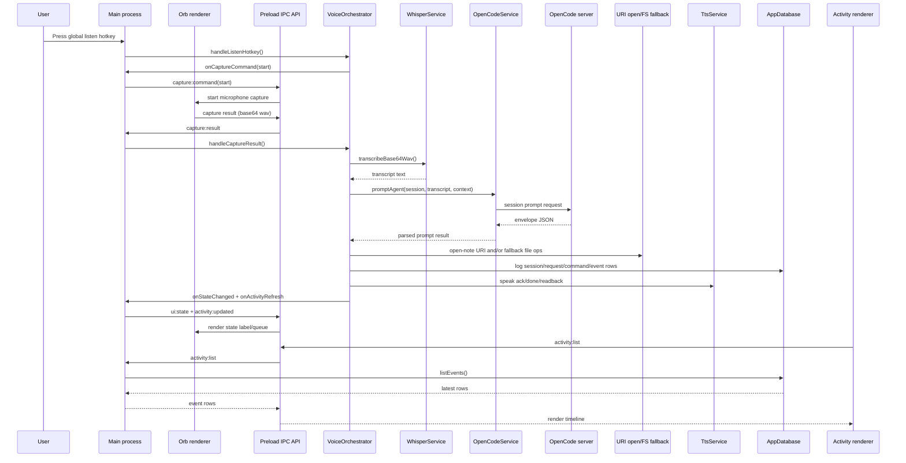

# Architecture and runtime flow

This page explains how one voice request travels through the system, how state transitions work, and where reliability features are applied.

## End-to-end request sequence

## Runtime layers and responsibilities

| Layer | Owns | Does not own |
|---|---|---|
| Renderer (`src/renderer`) | Browser UI, mic capture, local visual state | File system writes, child process spawning, DB writes |
| Preload (`src/preload`) | Minimal typed IPC bridge | Business logic |
| Main (`src/main`) | Lifecycle, orchestration, model/runtime calls, OpenCode, DB, file ops | Direct DOM manipulation |

## VoiceOrchestrator state machine

Orchestration state values are defined in `src/main/types.ts` and used across renderer updates:

- `idle`
- `listening`
- `transcribing`
- `agent_running`
- `awaiting_confirm`
- `executing`
- `tts_playing`
- `error`

The orchestrator updates state through callbacks registered by `main.ts`, which then publishes updates to the orb UI and activity window.

## Queueing and transaction semantics

`VoiceOrchestrator` supports a small in-memory queue for incoming transcripts:

- New request transcripts are enqueued.
- Only one active request is processed at a time.
- Additional transcripts can queue while agent work is in progress.
- Queue depth is pushed to UI state so the user sees backlog in real time.

This keeps the model interaction serial and avoids overlapping writes to session state.

## Session lifecycle

`VoiceOrchestrator` maintains an app-level session (`AppSession`) that wraps the OpenCode session id and local metadata:

- Session is created lazily on first request.
- Session holds `activeContextNotePath` for context-aware follow-up prompts.
- Session activity timestamp is touched on each request.
- Idle watcher expires session after `idleSessionExpiryMs` (default 30 minutes).

When session ends (user action, open-note completion, or timeout), queue and confirmation state are reset.

## Confirmation safety flow

Risky actions like rename/move are confirmation-gated at two levels:

- Prompt instruction requires explicit voice confirmation before execution.
- Agent envelope can return `needs_confirmation` with a replay token.

The orchestrator then:

1. Sets pending confirmation state.
2. Asks a TTS question.
3. Accepts only yes/no style utterances via regex checks.
4. Replays the pending operation with explicit follow-up instruction on yes.
5. Cancels and logs denial on no.

## Reliability and fallback strategy

Reliability is built from layered fallbacks:

- OpenCode client: SDK method calls -> raw endpoint calls -> legacy chat route.
- Obsidian actions: agent CLI result preferred -> app-level fallback file ops.
- STT: GPU attempt first when allowed -> CPU retry.
- TTS runtime setup: GPU package install preferred on Windows -> CPU package fallback.

## Observability model

Every request records:

- Request status lifecycle (`requests` table)
- Command runs from agent and app fallback (`command_runs` table)
- Human-readable events (`activity_events` table)

This makes production debugging possible without storing raw microphone audio.

<seealso>
    <category ref="related">
        <a href="Main-process-deep-dive.md"/>
        <a href="OpenCode-and-Obsidian-integration.md"/>
        <a href="Database-and-observability.md"/>
    </category>
</seealso>
