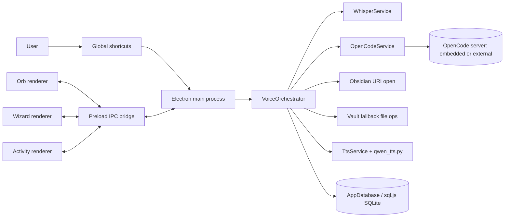

# %product% codebase guide

This documentation explains the codebase as a system, not just as a file list. If you are new to the project, read this page first and then follow the linked topics in order.

## What this project does

%product% is an Electron desktop assistant for Obsidian that is designed around voice-first interaction:

- You trigger listening with a global hotkey registered in the main process.
- The orb window captures microphone audio in the renderer process.
- The main process transcribes audio with local `whisper.cpp`.
- The transcript is sent to an OpenCode session for agent-style note actions.
- Agent-side actions prefer Obsidian CLI commands, and app-side fallback uses direct vault file operations when needed.
- Optional local TTS reads acknowledgements, outcomes, and note readback.
- A local SQLite database stores request, command, and activity telemetry.

## High-level architecture

## How to read this documentation

If you want to learn the codebase deeply, use this sequence:

1. [Codebase map](Codebase-map.md)
2. [Architecture and runtime flow](Architecture-and-runtime-flow.md)
3. [Main process deep dive](Main-process-deep-dive.md)
4. [Voice runtime services](Voice-runtime-services.md)
5. [OpenCode and Obsidian integration](OpenCode-and-Obsidian-integration.md)
6. [Renderer, preload, and IPC](Renderer-preload-and-ipc.md)
7. [Database and observability](Database-and-observability.md)

After that, use operations topics for day-to-day work:

- [Setup wizard and runtime bootstrap](Setup-wizard-and-runtime-bootstrap.md)
- [Testing and validation](Testing-and-validation.md)
- [Build, packaging, and GitHub Pages](Build-packaging-and-github-pages.md)
- [Troubleshooting and debugging](Troubleshooting-and-debugging.md)

## Mental model to keep in mind

The project is intentionally split into clear layers:

- `renderer` layer: captures UI input, displays state, and never touches privileged Node APIs directly.
- `preload` layer: exposes a controlled API surface from main to renderer.
- `main` layer: owns orchestration, runtime integration, file operations, sidecar lifecycle, and persistence.

That separation is the reason the system stays debuggable even though it coordinates local AI, CLI tools, and desktop windowing.

<seealso>
    <category ref="related">
        <a href="Codebase-map.md"/>
        <a href="Architecture-and-runtime-flow.md"/>
        <a href="Main-process-deep-dive.md"/>
    </category>
    <category ref="external">
        <a href="https://github.com/ggml-org/whisper.cpp">whisper.cpp repository</a>
        <a href="https://opencode.ai/docs/sdk/">OpenCode SDK docs</a>
    </category>
</seealso>
